# Домашнее задание к занятию "`Название занятия`" - `Фамилия и имя студента`
«Git» - «Бычков Денис Вячеславович»

### Инструкция по выполнению домашнего задания

   1. Сделайте `fork` данного репозитория к себе в Github и переименуйте его по названию или номеру занятия, например, https://github.com/имя-вашего-репозитория/git-hw или  https://github.com/имя-вашего-репозитория/7-1-ansible-hw).
   2. Выполните клонирование данного репозитория к себе на ПК с помощью команды `git clone`.
   3. Выполните домашнее задание и заполните у себя локально этот файл README.md:
      - впишите вверху название занятия и вашу фамилию и имя
      - в каждом задании добавьте решение в требуемом виде (текст/код/скриншоты/ссылка)
      - для корректного добавления скриншотов воспользуйтесь [инструкцией "Как вставить скриншот в шаблон с решением](https://github.com/netology-code/sys-pattern-homework/blob/main/screen-instruction.md)
      - при оформлении используйте возможности языка разметки md (коротко об этом можно посмотреть в [инструкции  по MarkDown](https://github.com/netology-code/sys-pattern-homework/blob/main/md-instruction.md))
   4. После завершения работы над домашним заданием сделайте коммит (`git commit -m "comment"`) и отправьте его на Github (`git push origin`);
   5. Для проверки домашнего задания преподавателем в личном кабинете прикрепите и отправьте ссылку на решение в виде md-файла в вашем Github.
   6. Любые вопросы по выполнению заданий спрашивайте в чате учебной группы и/или в разделе “Вопросы по заданию” в личном кабинете.
   
Желаем успехов в выполнении домашнего задания!
   
### Дополнительные материалы, которые могут быть полезны для выполнения задания

1. [Руководство по оформлению Markdown файлов](https://gist.github.com/Jekins/2bf2d0638163f1294637#Code)

---

### Задание 1
Что нужно сделать:

1 Зарегистрируйте аккаунт на GitHub.

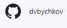

2 Создайте новый отдельный публичный репозиторий. Обязательно поставьте галочку в поле «Initialize this repository with a README».

3 Склонируйте репозиторий, используя https протокол git clone ....

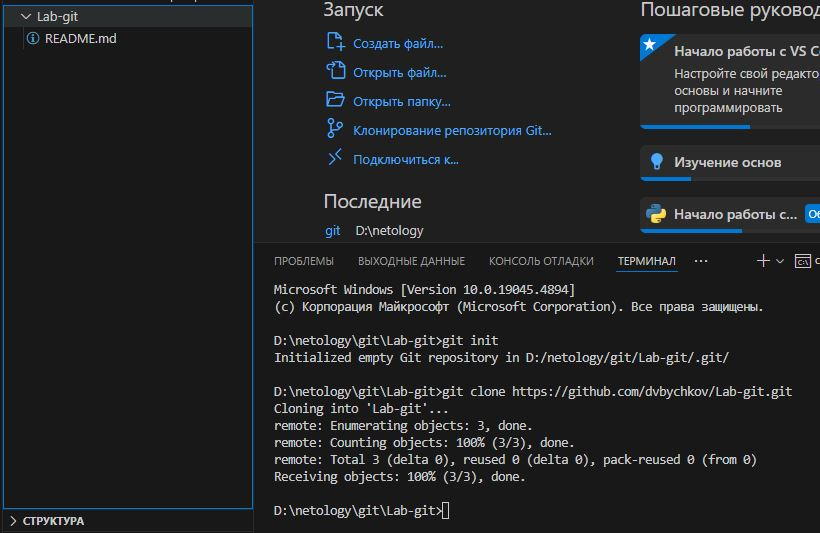

4 Перейдите в каталог с клоном репозитория.

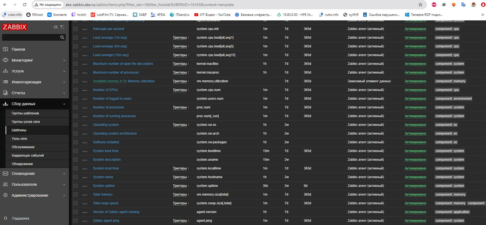

5 Произведите первоначальную настройку Git, указав своё настоящее имя и email: git config --global user.name и git config --global user.email johndoe@example.com.

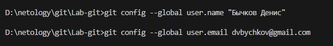

6 Выполните команду git status и запомните результат.

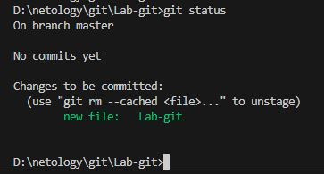

7 Отредактируйте файл README.md любым удобным способом, переведя файл в состояние Modified.

8 Ещё раз выполните git status и продолжайте проверять вывод этой команды после каждого следующего шага.

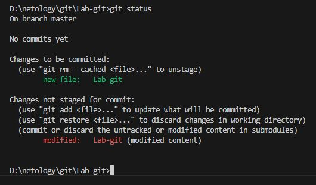

9 Посмотрите изменения в файле README.md, выполнив команды git diff и git diff --staged.

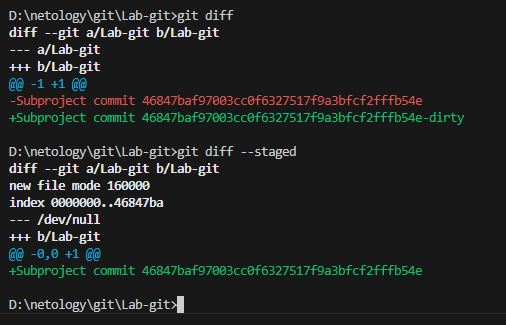

10 Переведите файл в состояние staged или, как говорят, добавьте файл в коммит, командой git add README.md.

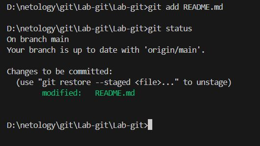

11 Ещё раз выполните команды git diff и git diff --staged.

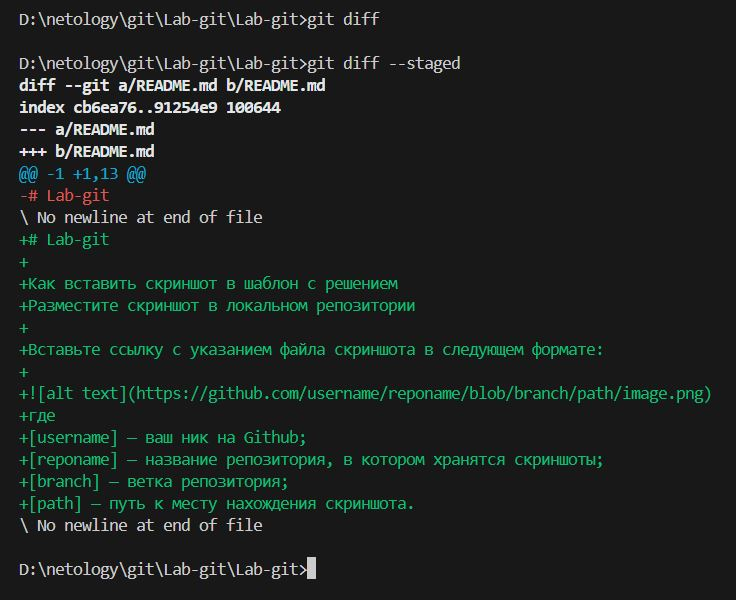

12 Теперь можно сделать коммит git commit -m 'First commit'.

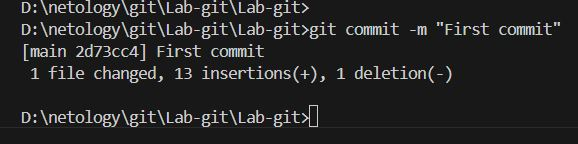

13 Сделайте git push origin master.

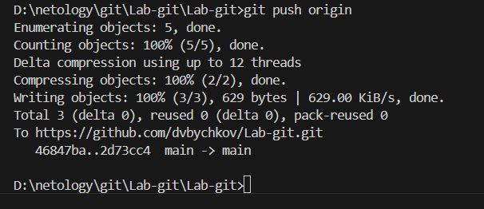

-  https://github.com/dvbychkov/Lab-git/blob/main/README.md

---

### Задание 2
Что нужно сделать:

1 Создайте файл .gitignore (обратите внимание на точку в начале файла) и проверьте его статус сразу после создания.

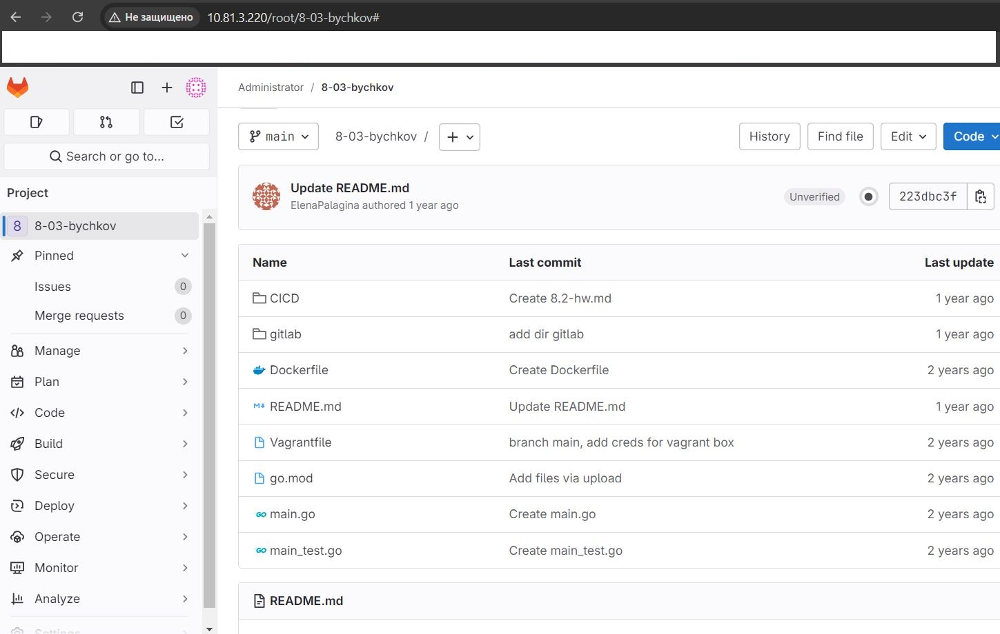

2 Добавьте файл .gitignore в следующий коммит git add....

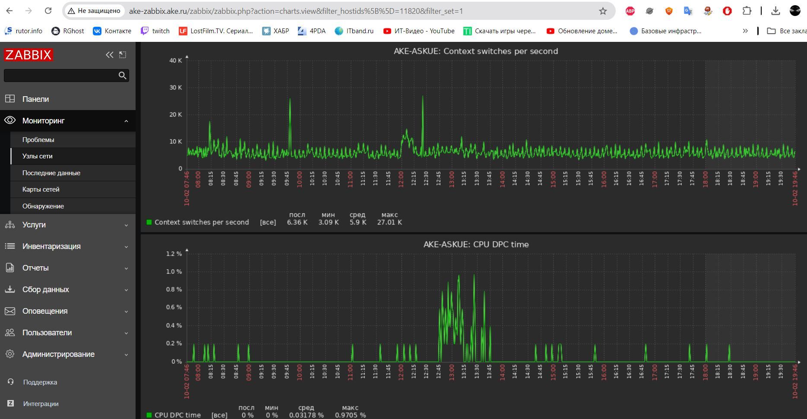

3 Напишите правила в этом файле, чтобы игнорировать любые файлы .pyc, а также все файлы в директории cache.

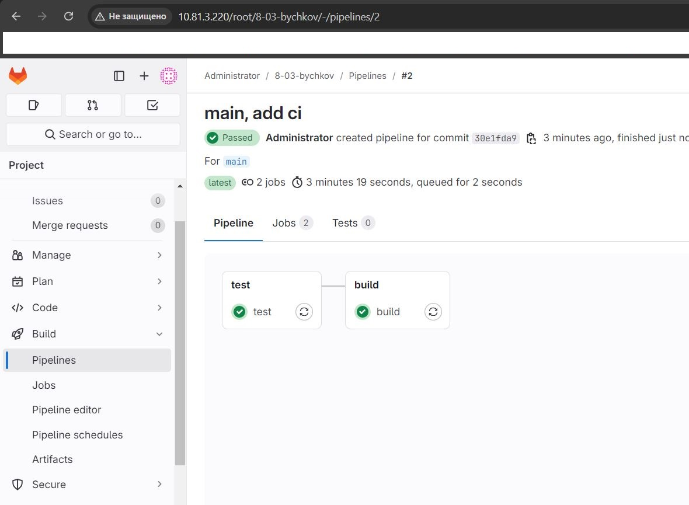

4 Сделайте коммит и пуш.

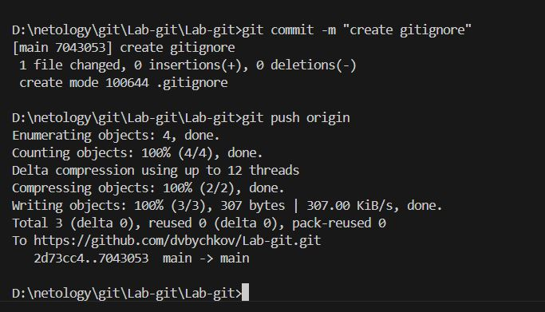

В качестве ответа добавьте ссылку на этот коммит в ваш md-файл с решением.

-  https://github.com/dvbychkov/Lab-git/blob/main/.gitignore
---

### Задание 3

Что нужно сделать:

1 Создайте новую ветку dev и переключитесь на неё.

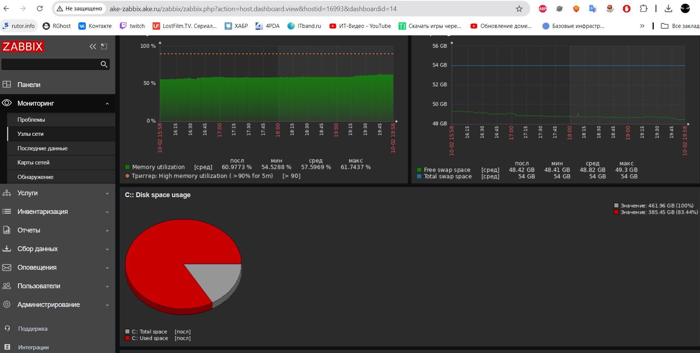

2 Создайте в ветке dev файл test.sh с произвольным содержимым.

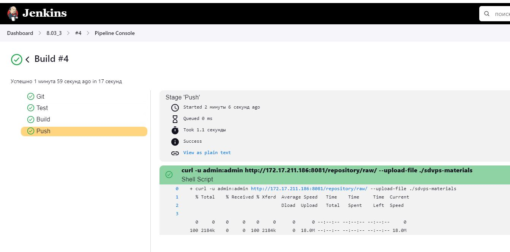

3 Сделайте несколько коммитов и пушей в ветку dev, имитируя активную работу над файлом в процессе разработки.

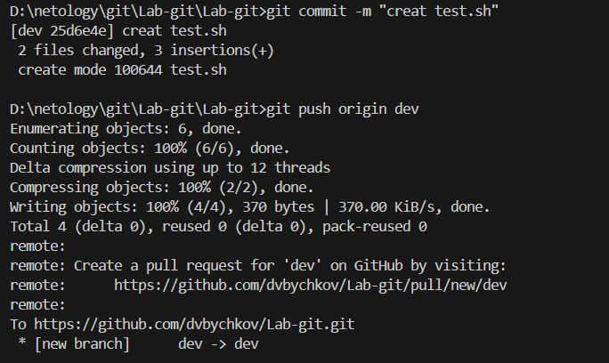

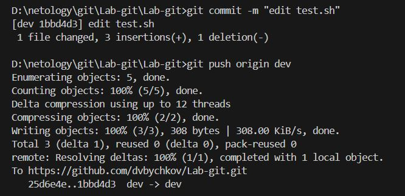

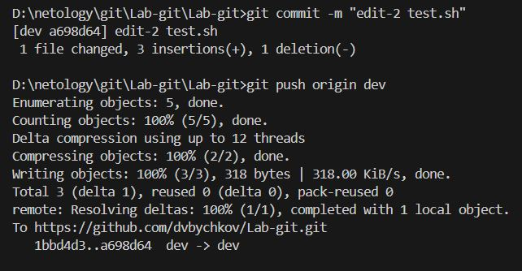

4 Переключитесь на основную ветку.

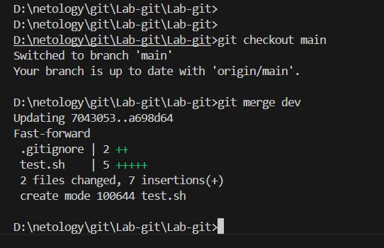

5 Добавьте файл main.sh в основной ветке с произвольным содержимым, сделайте комит и пуш . Так имитируется продолжение общекомандной разработки в основной ветке во время разработки отдельного функционала в dev ветке.

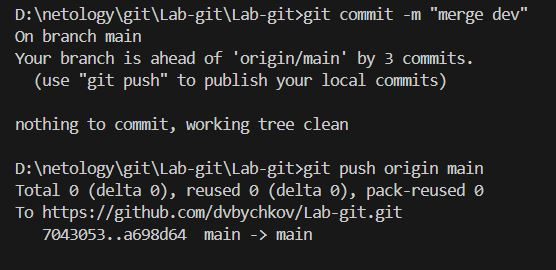

6 Сделайте мердж dev ветки в основную с помощью git merge dev. Напишите осмысленное сообщение в появившееся окно комита.
7 Сделайте пуш в основной ветке.
Не удаляйте ветку dev.

-  https://github.com/dvbychkov/Lab-git/network

### Задание 4

Сэмулируем конфликт. Перед выполнением изучите документацию.

Что нужно сделать:

1 Создайте ветку conflict и переключитесь на неё.

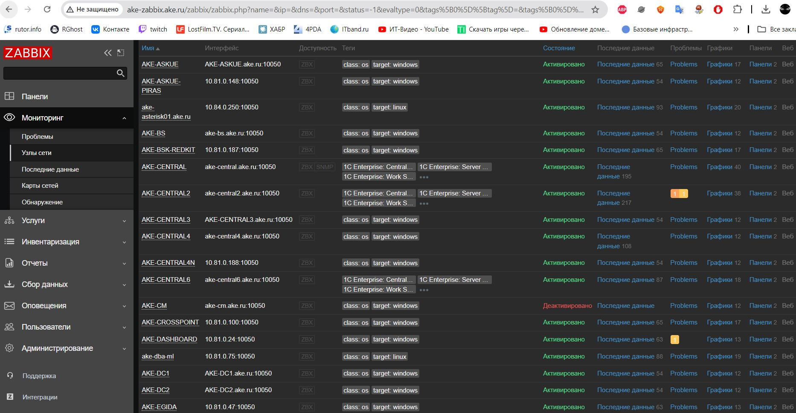

2 Внесите изменения в файл test.sh.

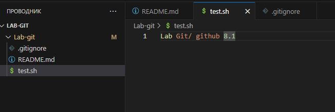

3 Сделайте коммит и пуш.

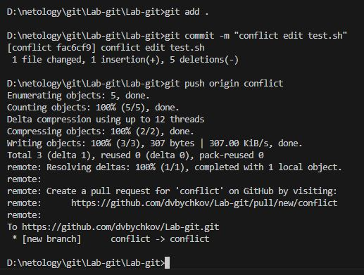

4 Переключитесь на основную ветку.

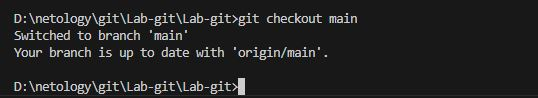

5 Измените ту же самую строчку в файле test.sh.

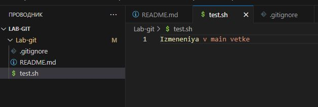

6 Сделайте коммит и пуш.

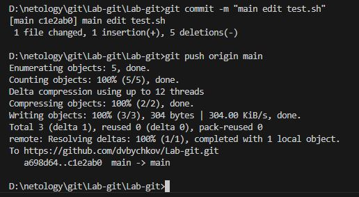

7 Сделайте мердж ветки conflict в основную ветку и решите конфликт так, чтобы в результате в файле оказался код из ветки conflict.

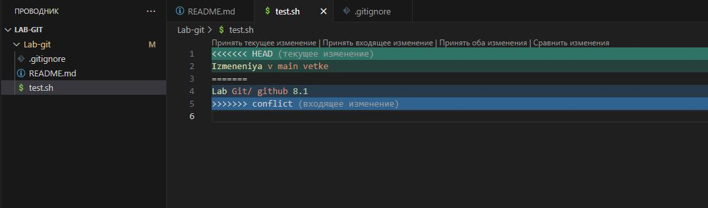

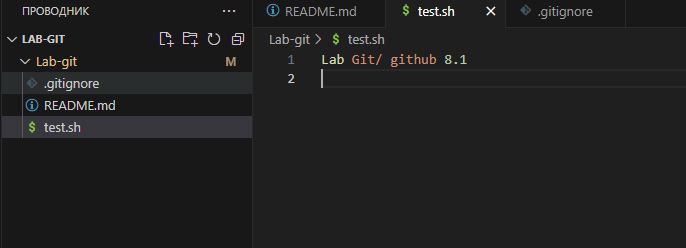

-  https://github.com/dvbychkov/Lab-git/network