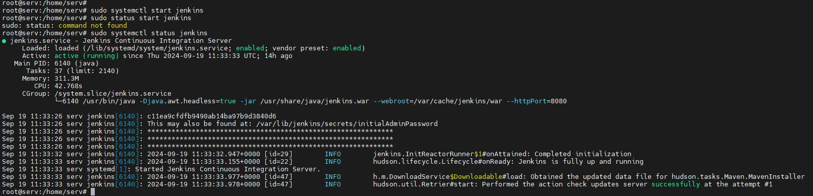
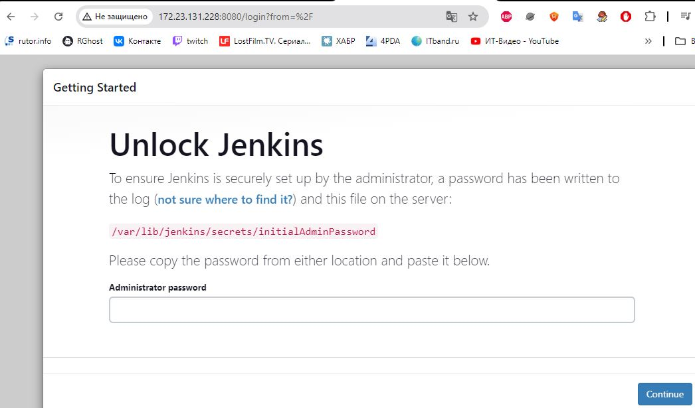
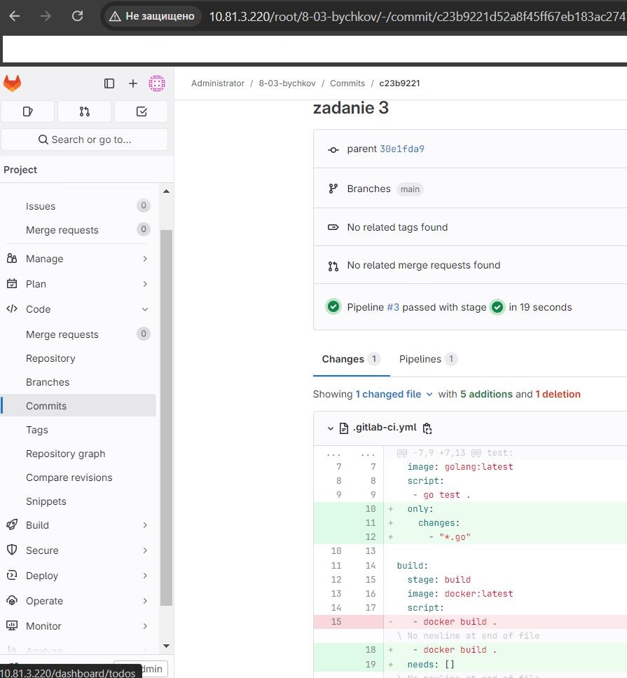
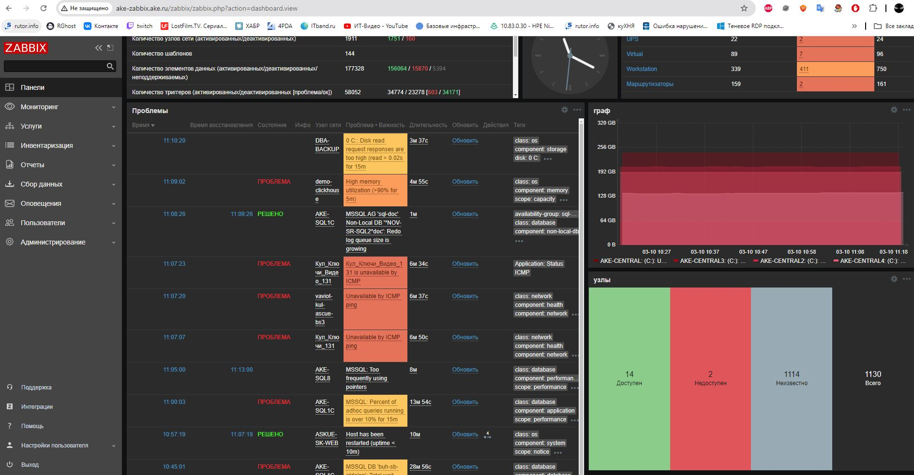
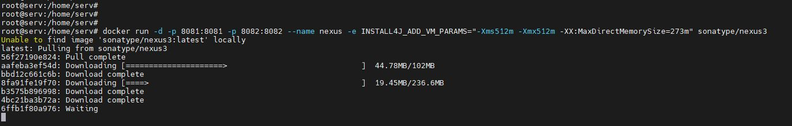
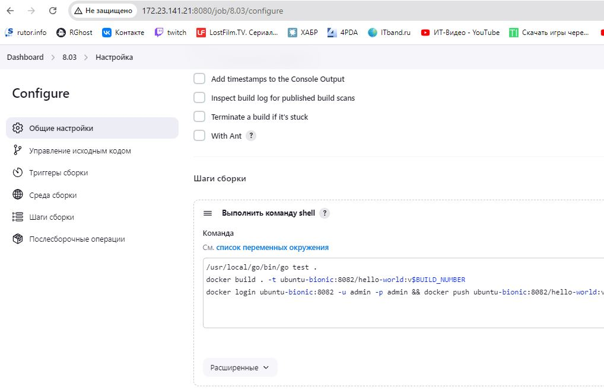
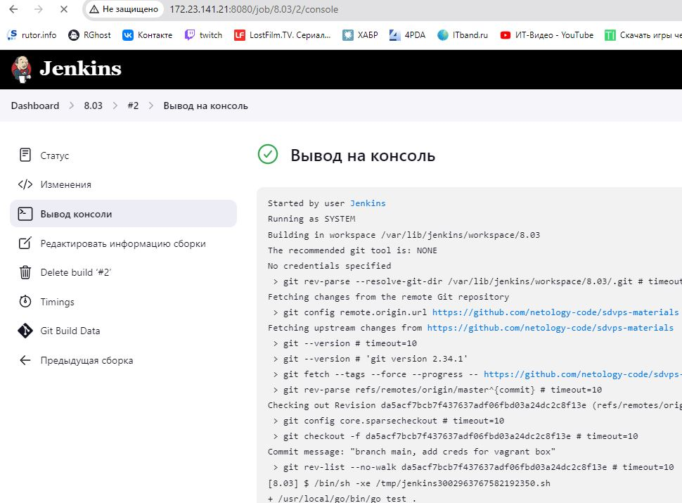
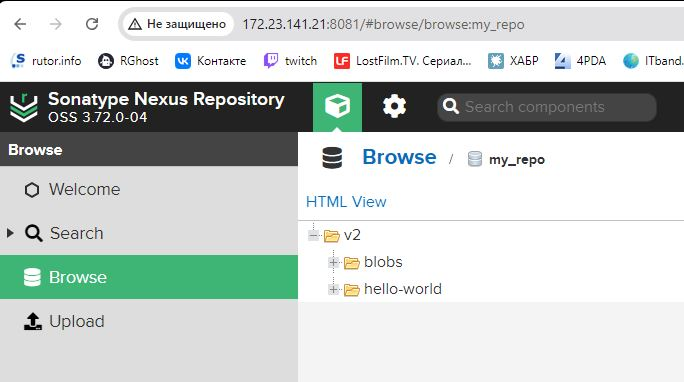
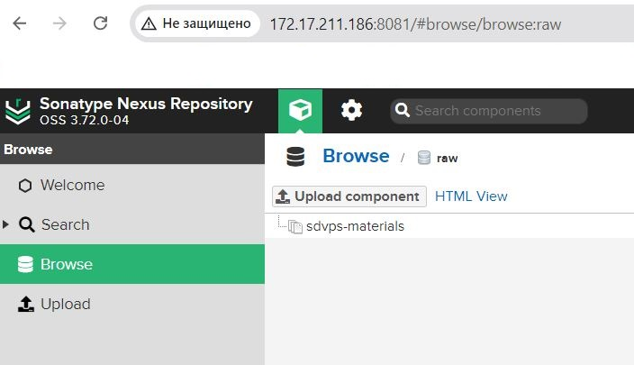

# Домашнее задание к занятию "`Название занятия`" - `Фамилия и имя студента`
«Что такое DevOps. СI/СD» - «Бычков Денис Вячеславович»

### Инструкция по выполнению домашнего задания

   1. Сделайте `fork` данного репозитория к себе в Github и переименуйте его по названию или номеру занятия, например, https://github.com/имя-вашего-репозитория/git-hw или  https://github.com/имя-вашего-репозитория/7-1-ansible-hw).
   2. Выполните клонирование данного репозитория к себе на ПК с помощью команды `git clone`.
   3. Выполните домашнее задание и заполните у себя локально этот файл README.md:
      - впишите вверху название занятия и вашу фамилию и имя
      - в каждом задании добавьте решение в требуемом виде (текст/код/скриншоты/ссылка)
      - для корректного добавления скриншотов воспользуйтесь [инструкцией "Как вставить скриншот в шаблон с решением](https://github.com/netology-code/sys-pattern-homework/blob/main/screen-instruction.md)
      - при оформлении используйте возможности языка разметки md (коротко об этом можно посмотреть в [инструкции  по MarkDown](https://github.com/netology-code/sys-pattern-homework/blob/main/md-instruction.md))
   4. После завершения работы над домашним заданием сделайте коммит (`git commit -m "comment"`) и отправьте его на Github (`git push origin`);
   5. Для проверки домашнего задания преподавателем в личном кабинете прикрепите и отправьте ссылку на решение в виде md-файла в вашем Github.
   6. Любые вопросы по выполнению заданий спрашивайте в чате учебной группы и/или в разделе “Вопросы по заданию” в личном кабинете.
   
Желаем успехов в выполнении домашнего задания!
   
### Дополнительные материалы, которые могут быть полезны для выполнения задания

1. [Руководство по оформлению Markdown файлов](https://gist.github.com/Jekins/2bf2d0638163f1294637#Code)

---

### Задание 1
Что нужно сделать:

Установите себе jenkins по инструкции из лекции или любым другим способом из официальной документации. Использовать Docker в этом задании нежелательно.

Установка Java
sudo apt install openjdk-11-jdk

Установите на машину с jenkins golang.

Используя свой аккаунт на GitHub, сделайте себе форк репозитория. В этом же репозитории находится дополнительный материал для выполнения ДЗ.
Создайте в jenkins Freestyle Project, подключите получившийся репозиторий к нему и произведите запуск тестов и сборку проекта go test . и docker build ..

В качестве ответа пришлите скриншоты с настройками проекта и результатами выполнения сборки.

### Задание 2
Что нужно сделать:

Создайте новый проект pipeline.
Перепишите сборку из задания 1 на declarative в виде кода.
В качестве ответа пришлите скриншоты с настройками проекта и результатами выполнения сборки.

pipeline {
 agent any
 stages {
  stage('Git') {
   steps {git 'https://github.com/netology-code/sdvps-materials.git'}
  }
  stage('Test') {
   steps {
    sh '/usr/local/go/bin/go test .'
   }
  }
  stage('Build') {
   steps {
    sh 'docker build . -t ubuntu-bionic:8082/hello-world:v$BUILD_NUMBER'
   }
  }
  stage('Push') {
   steps {
    sh 'docker login ubuntu-bionic:8082 -u admin -p admin && docker push ubuntu-bionic:8082/hello-world:v$BUILD_NUMBER && docker logout'   }
  }
 }
}

### Задание 3
Что нужно сделать:

Установите на машину Nexus.

Создайте raw-hosted репозиторий.

Измените pipeline так, чтобы вместо Docker-образа собирался бинарный go-файл. Команду можно скопировать из Dockerfile.

pipeline {
 agent any
 stages {
  stage('Git') {
   steps {git 'https://github.com/netology-code/sdvps-materials'}
  }
  stage('Test') {
   steps {
    sh '/usr/local/go/bin/go test .'
   }
  }
  stage('Build') {
   steps {
    sh '/usr/local/go/bin/go build -a -installsuffix nocgo'
   }
  }
  stage('Push') {
   steps {
    sh 'curl -u admin:admin http://172.17.211.186:8081/repository/raw/ --upload-file ./sdvps-materials'   }
  }
 }
}

Загрузите файл в репозиторий с помощью jenkins.
В качестве ответа пришлите скриншоты с настройками проекта и результатами выполнения сборки.

Дополнительные задания* (со звёздочкой)
Их выполнение необязательное и не влияет на получение зачёта по домашнему заданию. Можете их решить, если хотите лучше разобраться в материале.

### Задание 4*
Придумайте способ версионировать приложение, чтобы каждый следующий запуск сборки присваивал имени файла новую версию. Таким образом, в репозитории Nexus будет храниться история релизов.

Подсказка: используйте переменную BUILD_NUMBER.

В качестве ответа пришлите скриншоты с настройками проекта и результатами выполнения сборки.