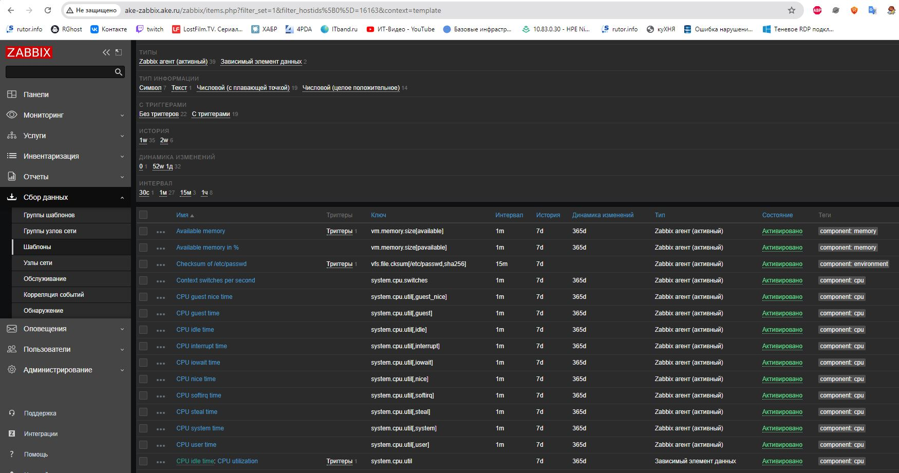
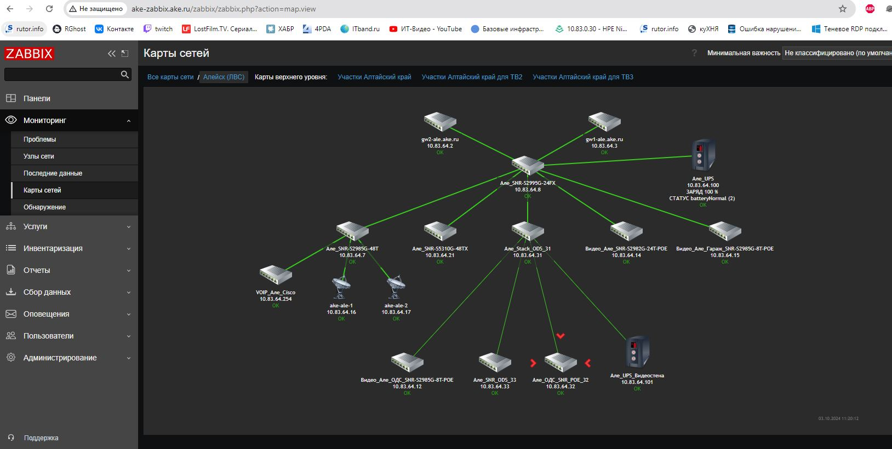

«Система мониторинга Zabbix. Часть 2» - «Бычков Денис Вячеславович»      

---
### Задание 1
Создайте свой шаблон, в котором будут элементы данных, мониторящие загрузку CPU и RAM хоста.

Процесс выполнения
1 Выполняя ДЗ сверяйтесь с процессом отражённым в записи лекции.
2 В веб-интерфейсе Zabbix Servera в разделе Templates создайте новый шаблон
3 Создайте Item который будет собирать информацию об загрузке CPU в процентах
4 Создайте Item который будет собирать информацию об загрузке RAM в процентах
Требования к результату
 Прикрепите в файл README.md скриншот страницы шаблона с названием «Задание 1»

### Задание 2
Добавьте в Zabbix два хоста и задайте им имена <фамилия и инициалы-1> и <фамилия и инициалы-2>. Например: ivanovii-1 и ivanovii-2.

Процесс выполнения
1 Выполняя ДЗ сверяйтесь с процессом отражённым в записи лекции.
2 Установите Zabbix Agent на 2 виртмашины, одной из них может быть ваш Zabbix Server
3 Добавьте Zabbix Server в список разрешенных серверов ваших Zabbix Agentов
4 Добавьте Zabbix Agentов в раздел Configuration > Hosts вашего Zabbix Servera
5 Прикрепите за каждым хостом шаблон Linux by Zabbix Agent
6 Проверьте что в разделе Latest Data начали появляться данные с добавленных агентов
Требования к результату
 Результат данного задания сдавайте вместе с заданием 3

### Задание 3
Привяжите созданный шаблон к двум хостам. Также привяжите к обоим хостам шаблон Linux by Zabbix Agent.

Процесс выполнения
1 Выполняя ДЗ сверяйтесь с процессом отражённым в записи лекции.
2 Зайдите в настройки каждого хоста и в разделе Templates прикрепите к этому хосту ваш шаблон
3 Так же к каждому хосту привяжите шаблон Linux by Zabbix Agent
4 Проверьте что в раздел Latest Data начали поступать необходимые данные из вашего шаблона
Требования к результату
 Прикрепите в файл README.md скриншот страницы хостов, где будут видны привязки шаблонов с названиями «Задание 2-3». Хосты должны иметь зелёный статус подключения

### Задание 4
Создайте свой кастомный дашборд.

Процесс выполнения
1 Выполняя ДЗ сверяйтесь с процессом отражённым в записи лекции.
2 В разделе Dashboards создайте новый дашборд
3 Разместите на нём несколько графиков на ваше усмотрение.
Требования к результату
 Прикрепите в файл README.md скриншот дашборда с названием «Задание 4»

### Задание 5* со звёздочкой
Создайте карту и расположите на ней два своих хоста.

Процесс выполнения
Настройте между хостами линк.
Привяжите к линку триггер, связанный с agent.ping одного из хостов, и установите индикатором сработавшего триггера красную пунктирную линию.
Выключите хост, чей триггер добавлен в линк. Дождитесь срабатывания триггера.
Требования к результату
 Прикрепите в файл README.md скриншот карты, где видно, что триггер сработал, с названием «Задание 5»

 