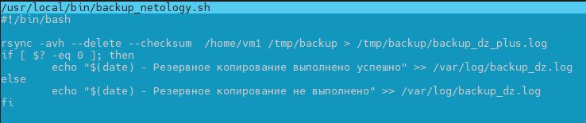
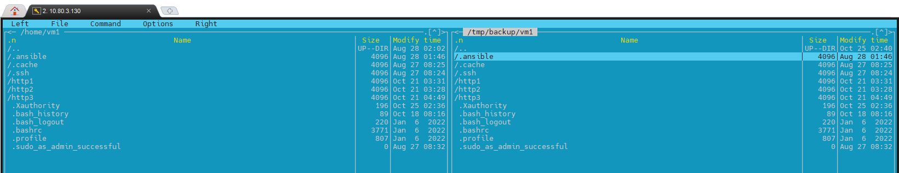

«Disaster recovery и Keepalived» - «Бычков Денис Вячеславович»      

---

### Задание 1

1 Дана схема для Cisco Packet Tracer, рассматриваемая в лекции.
2 На данной схеме уже настроено отслеживание интерфейсов маршрутизаторов Gi0/1 (для нулевой группы)
3 Необходимо аналогично настроить отслеживание состояния интерфейсов Gi0/0 (для первой группы).
4 Для проверки корректности настройки, разорвите один из кабелей между одним из маршрутизаторов и Switch0 и запустите ping между PC0 и Server0.
5 На проверку отправьте получившуюся схему в формате pkt и скриншот, где виден процесс настройки маршрутизатора.

hsrp_advanced.pkt - https://drive.google.com/file/d/1Lbiy1tEJe5S96fOqDgpvGve6ZWPQnWiM/view?usp=sharing

### Задание 2
1 Запустите две виртуальные машины Linux, установите и настройте сервис Keepalived как в лекции, используя пример конфигурационного файла.
2 Настройте любой веб-сервер (например, nginx или simple python server) на двух виртуальных машинах
3 Напишите Bash-скрипт, который будет проверять доступность порта данного веб-сервера и существование файла index.html в root-директории данного веб-сервера.
4 Настройте Keepalived так, чтобы он запускал данный скрипт каждые 3 секунды и переносил виртуальный IP на другой сервер, если bash-скрипт завершался с кодом, отличным от нуля (то есть порт веб-сервера был недоступен или отсутствовал index.html). Используйте для этого секцию vrrp_script
5 На проверку отправьте получившейся bash-скрипт и конфигурационный файл keepalived, а также скриншот с демонстрацией переезда плавающего ip на другой сервер в случае недоступности порта или файла index.html

keep_script.sh - https://drive.google.com/file/d/1jhW3Bh9npY28yPRwHHQJX7iXNFHVKybx/view?usp=sharing

keepalived.conf - https://drive.google.com/file/d/1V3n6Rx2fKn0ANbC2THQdPg6zZ-hB8nFs/view?usp=sharing